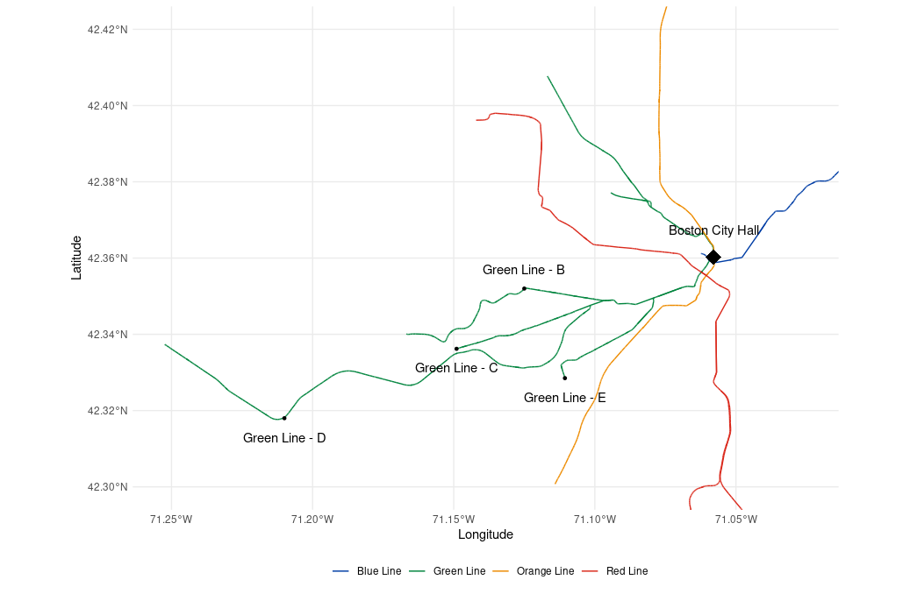

# MBTA Ridership Dashboard
This is an interactive R/Shiny dashboard that displays an interactive ridership summary of the Massachusetts Bay Transportation Authority transit system in Boston, Massachusetts. 

## Deployment
The application is deployed using [shinyapps.io](https://www.shinyapps.io/), and can be viewed [here](https://1nfmn7-andrew-disher.shinyapps.io/mbta-dashboard/).

## R/Shiny
The application was built using the R web application development package called [Shiny](https://www.rstudio.com/products/shiny/). Shiny is an open source
R package developed by [Posit](https://posit.co/products/open-source/rstudio/) with the aim of helping data scientists and analysts communicate statistical findings
by creating complex statistical web applications. 

## Ridership Data
The dashboard uses publicly available data, found on the MBTA open data portal, [Blue Book](https://mbta-massdot.opendata.arcgis.com/). 
Average weekday ridership data for bus routes, rapid transit routes, and ferry routes, as well as all of the stops along these routes are available for 
the Fall 2018 and Fall 2019 season across the three modes of transportation. 

Data for some modes of transportation is available for an additional number of years,
either before or after the 2018-2019 range, but the data availability was not consistent, so only data from 2018-2019 was included. 

This repository contains a cleaned, aggregated version of the data, but the original raw form is available at the [Ridership directory](https://mbta-massdot.opendata.arcgis.com/search?tags=ridership)
of the above link. 

## Geographic Data Shape Files
In addition to ridership data, shapefiles for the geography of each route and stop are also available at the data portal, 
specifically in the [GTFS directory](https://mbta-massdot.opendata.arcgis.com/maps/MassDOT::mbta-systemwide-gtfs-map/explore).

These files were used to generate customized shape files, with the aid of the `sf` R package. Many routes had the same ids in the original shape files, since portions of each route 
were separated as per the MBTA file convention. These custom files differ from the original shape files only in that portions of each route were **attached** such that every route
had a unique id, and each route comprised of each of its respective sections to form a continuous line on a map. 

An exception to this is the case of the MBTA's Green Line, which is actually comprised of the B, C, D, and E routes of the Green Line. These are in fact separate routes, however, data
from the Ridership link above generalized ridership to the sum of its parts (B, C, D, and E). Therefore, the choice was made to connect each of these subroutes to form one, continuous line. 

The result of this action can be seen in the image below, where all 4 sections form a single Multilinestring (to use [Well-Known-Text](https://en.wikipedia.org/wiki/Well-known_text_representation_of_geometry) terminology).

## Dependency Management
To ensure that the dashboard is stable and easily re-deployed given any number of feature or styling changes, its package dependencies were tracked
using the `renv` R package. This creates a json-like file, titled *renv.lock*, which stores information about each dependency, its version, and subsequent dependencies. 

Shinyapps.io ensured base linux dependencies were managed before deploying to a server, however a dockerfile could easily be used to track this information as well
in the case of deploying to, for example, an AWS EC2 instance. This is my typical approach, since I typically deploy my apps to EC2 instances. Shinyapps.io was chosen 
this time because I wanted to explore other options. 

## Effort In Build the Application
The total amount of time invested in creting this application was about 7 days, much of which was spent finding the data, examining variable definitions, and cleaning the data. 

## Special Mentions
Thank you to appsilon for creting the `rhino` R/Shiny framework, which was used to create the application. Additionally, thank your for created the Appsilon template
bundle, which greatly inspired the design choices used to create the app.  
